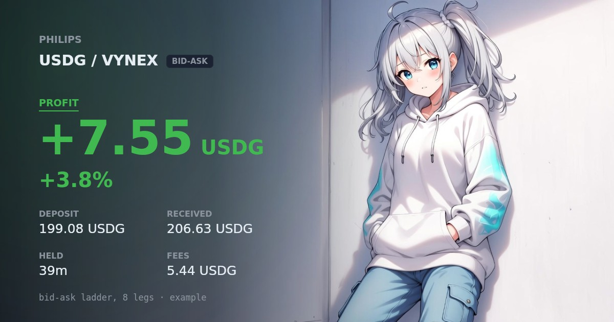

# PHILIPS



**A Telegram bot that opens single-sided liquidity positions for you.**

You deposit one token. The position sits there like a limit order, earning trading
fees while it waits for your price. When price arrives, your deposit converts into
the other token, and you were paid to wait.

No dashboards, no browser wallet. You tap buttons in a Telegram chat.


## Install in one command

On a fresh Ubuntu server :

```bash
curl -fsSL https://raw.githubusercontent.com/whoismoaru/PHILIPS/main/philips.sh -o philips.sh && bash philips.sh
```

Pick **option 1**. The script installs Node, downloads the code, asks you a few
questions, and starts the bot as a system service. It never asks for your private
key. That happens inside Telegram, later.

You will need two things before you start :

| What | Where to get it |
|---|---|
| A bot token | Message [@BotFather](https://t.me/BotFather), send `/newbot` |
| Your Telegram id | Message [@userinfobot](https://t.me/userinfobot) |

An RPC endpoint helps too. Use a keyed one (Alchemy, your own node).
Free public endpoints rate-limit, and then every read fails at once.

---

## First run

After the installer finishes, open Telegram and talk to your bot :

**1.** Send `/start`. You should see a welcome card. If nothing happens, your
Telegram id in `.env` is wrong. Only that one account can use the bot.

**2.** Send `/settings` → **Connect Wallet** → paste a private key or seed phrase.
The message is deleted from the chat immediately, and the key is stored encrypted
on your server (`data/keystore.json`, scrypt + AES, file mode 600).

**3.** Send `/portfolio`. Your balances should appear. If they do, the bot can read
the chain correctly.

**4.** Try `/add_lp` and walk through the wizard without confirming. The bot starts
in **DRY RUN**, so it simulates everything and sends no transactions.

**5.** When all of that looks right, run `bash philips.sh` again and pick
**option 6** to switch to LIVE. Start with a small amount.

---

## Opening a position

Send `/add_lp`, or just paste a token's contract address into the chat.

**Step 0. The bot screens the token first.** Contract verified or proxy, how
concentrated the holders are, how deep the liquidity is, how old the pool is, and
a simulated sell to catch honeypots.

  The card reports what it found and leaves the judgement to you. One case is not
  left to you: a token that fails the hard checks **stops the wizard**, and there is
  no button to override it.

**Step 1. Pick a pool.** Up to three, ranked by liquidity and volume, gathered
from the Uniswap gateway, Krystal, and on-chain scans.

**Step 2. Pick which side you deposit.**

- **Base side.** You deposit ETH / BNB / a stablecoin. The position waits *below*
  the current price. It's a limit buy that earns fees while it waits.
- **Token side.** You deposit the token itself. The position waits *above* the
  price. A limit sell that earns fees while it waits.

**Step 3. Pick how wide the range is.** From conservative to extreme.

**Step 3b. Pick the shape** (base side only).

- **Spot.** One position near the price. Simplest, and it harvests the most fees.
- **Bid-Ask.** A ladder of several positions, with more money placed at the lower
  prices. It buys more of the token the deeper it dips and protects your capital,
  but earns less in fees. You pick how many legs **8 to 10 is the sweet spot**.
  More legs is smoother but needs a paid RPC; on a free endpoint it makes the bot
  slow. All the legs open in one batched transaction and are managed as one position.

  Open any leg and the card shows the ladder first deposit, current value, fees,
  PnL, and how many rungs are filled, active, or still waiting then the one leg you
  tapped. A leg that fills is doing its job, so it is marked filled rather than
  flagged as a position gone wrong.

**Step 4. How much.** Tap a percentage of your balance, or type an exact number.
Percentages are taken from your *usable* balance: the gas reserve is set aside
first, so the largest button never leaves you unable to pay for the transaction.
The buttons themselves are yours to change see **Quick percentages** below.

**Step 5. Review and confirm.** The card shows the real price range, what you're
depositing, and the estimated gas. Nothing is signed until you tap confirm.

---

## Commands

| Command | What it does |
|---|---|
| `/start` · `/help` | Menu and bot mode |
| `/portfolio` | Total equity, and what you hold on each chain |
| `/positions` | Your live positions; tap one for full detail |
| `/pnl` | Profit recap from closed trades, as a picture card |
| paste a contract address | Audit the token, then open a position, buy, or sell |
| `/claim_fees` | Take the fees, leave the position running |
| `/stop` | List your positions with a close button on each |
| `/buy` · `/sell` | Swap a token via the best available route |
| `/unwrap` | Turn stuck wrapped native back into gas, on every chain at once |
| `/bridge` | Move funds between chains |
| `/settings` | Wallet, transaction limits, quick percentages |
| `/alerts` | Which notifications you want |

Every step has **Back** and **Cancel**. Anything that moves money takes one
explicit confirmation tap and is guarded against double-taps.

`/positions` lists what is open, one block per position:

```
POSITIONS

🟢 USDT / PONS (V3)
- ID: #1234567
- Strategy: USDT Side (Buy the dip)
- Invested: 197.2980 USDT
- Status: Active (In Range) · 30m
- Uncollected Fees: +$8.48
- PnL: +2.4%

🟢 USDG / VYNEX  ◣×8 (V4)
- ID: #1234568
- Strategy: USDG Side (Buy the dip)
- Invested: 199.0800 USDG
- Status: Active (In Range) · 25m
- Uncollected Fees: +$6.70
- PnL: +3.1%

Your liquidity is in range and earning fees.
```

Tap one for the full card. A ladder shows the whole ladder first, then the leg you
opened:

```
📊 Position Details: #1234568

🔗 Pair: USDG / VYNEX (3.01% Fee) · Robinhood
🎯 Strategy: USDG Side (Buy the dip) · ◣ Bid-Ask ladder

🪜 LADDER · 8 legs
💰 Deposit: 199.0807 USDG
💰 Value now: 204.23 USDG
↳ incl. fees 5.44 USDG
📈 Ladder PnL: +$5.15 (+2.6%)
📉 Ladder Range: $545.5K ⇄ $49.1K · now $457.2K
🎚 Rungs: 0 filled · 1 active · 7 waiting

— leg 1 of 8, 2.8% of ladder capital —
💰 Leg Value: 6.16 USDG
↳ incl. fees 0.91 USDG (+16.4% of capital)
📉 Leg Range: +19.3% / -11.7% from current price
↳ market cap $545.5K ⇄ $403.7K
📈 Leg PnL: +$0.63 (+11.3%)
🟢 Status: IN RANGE

Your liquidity is active and earning fees. Fees keep accruing as long as VYNEX
stays inside this range.
```

`/portfolio` answers the other question, where your money actually is:

```
PORTFOLIO

💰 Equity Summary :
- Total Equity = $1,250.00
- Unstaked Balance = $850.00 (ETH, USDG, BNB, USDT, HYPE)
- Active in LP = $400.00 (8 Positions)

📊 Asset Breakdown :
- Robinhood = 0.3000 ETH ($750.00) | 25.00 USDG ($25.00)
- BSC = 0.0800 BNB ($56.00) | 12.00 USDT ($12.00)
- Base = 0.0010 ETH ($2.50)
- HyperEVM = 0.0500 HYPE ($4.50)

✅ LIVE: 21:50 WIB
```

`/pnl` sums up the trades you have closed, per chain and per period:


All figures on this page are examples, not anyone's real history.

---

## Closing a position

`/stop` lists what you have open and puts a close button on each one. Tapping close
on any leg of a ladder closes the whole ladder in one batched transaction. Either
way the bot withdraws the liquidity, collects the fees, swaps the token side back to
what you deposited, and sends you a result card: deposit, received, how long you held
it, and the fees you earned.

That card is the image at the top of this page. The artwork behind it is just a
file. Drop your own `data/PHILIPS ANIME.jpg` in and every card uses it instead.
Wide images with the subject on one side work best; the text sits on the other.

The result is always reported in **the asset you deposited**. Deposit USDG, get the
answer in USDG. Converting it to dollars would fold the base asset's own price swing
into a number that is supposed to measure the position alone.

Withdrawals carry a price floor. If someone pushes the pool to the edge of your
range while the transaction is in flight, it reverts instead of filling at whatever
price they made. On the rare occasion the floor cannot be worked out, the bot says
so on the card rather than staying quiet.

---

## Quick percentages

Every amount step shows percentage buttons. You decide what they are.

`/settings` → **Buy %**, **Sell %**, **Add LP %**, **Withdraw %**, **Bridge %**,
and **Ladder legs** (how many rungs a bid-ask ladder offers, 2 to 69).
Each one opens a small card with the current numbers and an **Edit** button. Type up
to four numbers `10 25 50 90`, `10,25,50`, or `10/25/50` all work and they become
the buttons for that flow. **Reset** puts the defaults back.

Withdraw is the one exception: 100% is not allowed there, because taking everything
out closes the position, and that has its own button. Ladder legs takes counts
rather than percentages, so its range is 2 to 69.

Your choices live in `data/pctpresets.json` and survive restarts.

---

## Chains

Five are configured out of the box. Turn the extra ones on in `.env`:

| Chain | DEX | You can deposit |
|---|---|---|
| Robinhood | Uniswap v3 + v4 | ETH · USDG |
| BSC | PancakeSwap v3 + Uniswap v3 | BNB · USDT |
| Base | Uniswap v3 | ETH · USDC |
| HyperEVM | HyperSwap v3 | HYPE · USDT0 |
| Ink | Velodrome Slipstream | ETH · USDT0 |

The primary chain is whatever you put in `.env`. It was built and tested against
Robinhood Chain. Pointing it at a different EVM chain works, but you'll need to
edit `src/chains.ts` (the explorer URL and the stablecoin address are set there).

---

## Read this before you fund it

This bot holds a hot wallet key and signs transactions on its own. Treat it like
a hot wallet, not a vault.

- **One owner.** Your Telegram id is the entire access control. Anyone who gets
  into that Telegram account controls the wallet. Don't share the bot.
- **It signs unattended.** A background loop sweeps leftover tokens and unwraps
  stray WETH by itself, once a minute.
- **There is no stop-loss.** A position that moves against you keeps running until
  you close it. Alerts tell you; they don't act.
- **Closing cashes out your whole bag.** `/stop` doesn't stop at the position's own
  output. It swaps **every** unit of that token in the wallet. If you hold the same
  token outside the LP, move it elsewhere first.
- **Per-transaction caps** (`MAX_ETH_PER_TX`, `MAX_STABLE_PER_TX`) can be raised in
  `.env`, or switched off with `off`. Leaving them empty does *not* remove them
  it falls back to the built-in defaults, so a typo can't quietly open the wallet.
  With the caps off, the only ceiling is the balance you actually hold.
- **Gas has its own ceiling** (`MAX_TX_FEE_NATIVE`, default `0.005` native). It is
  checked at broadcast, so every path is covered. A transaction that could cost more
  is refused before it is sent.
- **Your keystore is only as strong as `WALLET_SECRET`.** The installer generates a
  random one. Anyone who can read both your disk and your `.env` can open the wallet.

What the bot does do for you:

- **Approvals are for the exact amount**, never unlimited. A router you swap through
  once cannot come back for the rest of your balance later.
- **Swaps have a floor.** The minimum output comes from a quote and is never zero, so
  a swap that would land far below the price you agreed to reverts instead.
- **On BSC, transactions go out through a private relay** so they never sit in the
  public mempool waiting to be sandwiched. The other four chains have a single
  sequencer and no public mempool, so there is nothing to hide from there.
- **Every transaction is simulated first.** If the simulation reverts, nothing is sent.

---

## Your data

Everything lives in `data/`, which is never committed to git:

`keystore.json` (your encrypted key) · `positions.json` · `v4positions.json` ·
`journal.jsonl` · `settings.json` · `alerts.json` · `pctpresets.json`

**Back up that folder.** `journal.jsonl` and `positions.json` are the only record
of what you paid for each position. If `positions.json` is ever corrupt, the bot
moves it aside and refuses to start rather than quietly overwriting it.

---

## Running it yourself

If you'd rather not use the installer:

```bash
git clone https://github.com/whoismoaru/PHILIPS.git philips && cd philips
npm ci
cp .env.example .env      # every field is documented inside
npm start
```

Needs Node 20 or newer.

**Read-only checks.** None of these send a transaction:

```bash
npm run check                        # typecheck
npx tsx scripts/smoke.ts             # read prices, build a plan
npx tsx scripts/smoke-journal.ts     # accounting sanity

for f in scripts/smoke-*.ts; do npx tsx "$f"; done   # all of them
```

The `smoke-*` scripts also stand in for a test suite. They cover the parts where a
mistake costs money: slippage ladders, approval amounts, withdrawal price floors,
sell routing, and PnL accounting.

---

## When something breaks

| Symptom | Fix |
|---|---|
| Bot doesn't reply | `sudo journalctl -u philips-bot -n 50`; usually a wrong Telegram id |
| "Missing X in your .env file" | That field is empty. `bash philips.sh` → option 3 |
| Every read fails at once | Your RPC is rate-limiting. Use a keyed endpoint |
| Transaction says insufficient funds | Not enough native token left for gas; try `/unwrap` |
| Position won't close | Check `journalctl`; the bot holds tokens rather than dumping them at any price |

---

## Not supported

Multiple users on one instance · non-custodial signing · automatic position opening

---

MIT licensed. Run your own instance.
